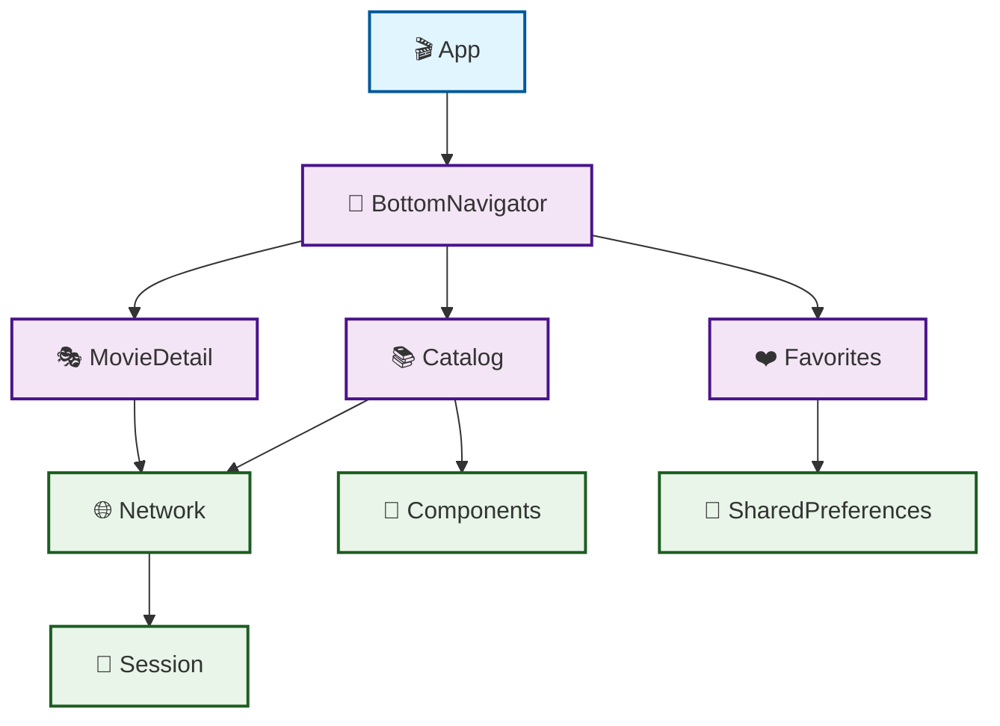

# 🎬 MovieApp

Um aplicativo iOS moderno para explorar e descobrir filmes, construído com Swift e arquitetura modular baseada em VIPER.

## ✨ Características

- 🏗️ **Arquitetura VIPER**: Organizado em módulos independentes seguindo princípios SOLID
- 📦 **Swift Package Manager**: Gerenciamento modular de dependências
- 📱 **SwiftUI**: Interface nativa moderna e responsiva
- 🗂️ **Catálogo de Filmes**: Explore uma vasta coleção de filmes
- ❤️ **Favoritos**: Salve seus filmes preferidos para acesso rápido
- 🧭 **Navegação Bottom Tab**: Interface de navegação intuitiva
- 🎭 **Detalhes do Filme**: Visualize informações detalhadas dos filmes
- 🌐 **Networking**: Camada de rede robusta com suporte a Async/Await
- 💾 **Session Management**: Gerenciamento de sessão e preferências

## 🏗️ Arquitetura

O projeto utiliza uma arquitetura modular baseada em **VIPER** (View, Interactor, Presenter, Entity, Router) com separação clara de responsabilidades:

```
📦 MovieApp
├── 🎬 App/                    # Aplicativo principal
│   └── MovieApp/
│       ├── MovieApp.swift     # Entry point da aplicação
│       └── Assets.xcassets/   # Recursos visuais
│
├── 🧩 Modules/
│   ├── 🛠️ Commons/           # Módulos compartilhados
│   │   ├── 🌐 Network/        # Camada de rede
│   │   │   ├── NetworkService.swift
│   │   │   ├── Endpoint.swift
│   │   │   ├── NetworkError.swift
│   │   │   └── Networkable.swift
│   │   │
│   │   ├── 🎨 Components/     # Componentes reutilizáveis
│   │   │   └── GalleryView.swift
│   │   │
│   │   ├── 🔐 Session/        # Gerenciamento de sessão
│   │   │   └── SessionManager.swift
│   │   │
│   │   └── 💾 SharedPreferences/ # Preferências compartilhadas
│   │       └── SharedPreferences.swift
│   │
│   └── 🎯 Features/           # Módulos de funcionalidades
│       ├── 🧭 BottomNavigator/ # Sistema de navegação
│       │   ├── BottomNavigatorConfigurator.swift
│       │   ├── BottomNavigatorView.swift
│       │   ├── BottomNavigatorPresenter.swift
│       │   ├── BottomNavigatorInteractor.swift
│       │   └── BottomNavigatorModels.swift
│       │
│       ├── 📚 Catalog/        # Catálogo de filmes
│       │   ├── CatalogConfigurator.swift
│       │   ├── CatalogView.swift
│       │   ├── CatalogPresenter.swift
│       │   ├── CatalogInteractor.swift
│       │   ├── CatalogModels.swift
│       │   └── Data/
│       │
│       ├── ❤️ Favorites/      # Gerenciamento de favoritos
│       │   ├── FavoritesConfigurator.swift
│       │   └── FavoritesView.swift
│       │
│       └── 🎭 MovieDetail/    # Detalhes do filme
│           ├── MovieDetailConfigurator.swift
│           └── MovieDetailView.swift
```

### 🎯 Padrão VIPER

Cada feature segue o padrão VIPER:

- **View**: Componentes SwiftUI responsáveis pela interface
- **Interactor**: Lógica de negócio e comunicação com serviços
- **Presenter**: Coordena a comunicação entre View e Interactor
- **Entity**: Modelos de dados
- **Router/Configurator**: Configuração e navegação entre módulos

### 🔗 Dependências entre Módulos



**Legenda:**
- 🎬 **App**: Aplicativo principal
- 🧭 **Features**: Módulos de funcionalidades
- 🛠️ **Commons**: Módulos compartilhados

## 🚀 Como Executar

### Pré-requisitos

- 📱 **Xcode 15.0+**
- 🍎 **iOS 16.0+**
- 🔧 **Swift 6.1+**
- 💻 **macOS 13.0+**

### Passos para executar

1. **Clone o repositório**
   ```bash
   git clone https://github.com/rodrigogmdias/movieapp.git
   cd movieapp
   ```

2. **Abra o projeto no Xcode**
   ```bash
   open App/MovieApp.xcodeproj
   ```

3. **Aguarde a resolução das dependências**
   - O Xcode resolverá automaticamente os Swift Packages

4. **Selecione o simulador ou dispositivo**
   - Escolha seu dispositivo iOS ou simulador preferido

5. **Execute o projeto**
   - Pressione `⌘ + R` ou clique no botão "Run"

## 🧪 Executando Testes

### Testes via Xcode
```bash
# Todos os testes
⌘ + U

# Testes específicos
⌘ + Shift + U
```

### Testes via Terminal
```bash
# Navegar até o diretório do projeto
cd movieapp

# Executar testes de módulos específicos
# IMPORTANTE: Mantenha a mesma estrutura de pastas para navegar corretamente
cd Modules/Features/BottomNavigator && swift test
cd ../Catalog && swift test
cd ../../Commons/Network && swift test
cd ../Session && swift test
cd ../SharedPreferences && swift test
cd ../Components && swift test
```

### Executar todos os testes
```bash
# Script para executar todos os testes
# Navega seguindo a estrutura de pastas do projeto
for module in Modules/Features/*/; do
    echo "🧪 Testando $(basename "$module")"
    cd "$module" && swift test && cd - > /dev/null
done

for module in Modules/Commons/*/; do
    echo "🧪 Testando $(basename "$module")"
    cd "$module" && swift test && cd - > /dev/null
done
```

> **📁 Estrutura de Pastas para Testes:**
> 
> Os testes seguem a mesma estrutura hierárquica do projeto. Certifique-se de estar no diretório correto antes de executar os comandos:
> 
> ```
> movieapp/
> ├── Modules/
> │   ├── Features/
> │   │   ├── BottomNavigator/
> │   │   ├── Catalog/
> │   │   └── ...
> │   └── Commons/
> │       ├── Network/
> │       ├── Session/
> │       └── ...
> ```

## 🛠️ Tecnologias Utilizadas

- **SwiftUI** - Framework de interface do usuário declarativa
- **Swift Package Manager** - Gerenciamento de dependências e módulos
- **Combine** - Framework de programação reativa
- **Async/Await** - Programação assíncrona moderna
- **VIPER** - Arquitetura modular para iOS
- **Xcode** - IDE de desenvolvimento
- **iOS SDK** - Plataforma de desenvolvimento

## 📝 Estrutura de Código

### Convenções de Nomenclatura
- **Files**: PascalCase (ex: `MovieDetailView.swift`)
- **Classes/Structs**: PascalCase (ex: `NetworkService`)
- **Variables/Functions**: camelCase (ex: `fetchMovies()`)
- **Constants**: camelCase (ex: `baseURL`)

### Organização de Arquivos
```
ModuleName/
├── Package.swift
├── Sources/
│   └── ModuleName/
│       ├── ModuleConfigurator.swift
│       ├── ModuleView.swift
│       ├── ModulePresenter.swift
│       ├── ModuleInteractor.swift
│       └── ModuleModels.swift
└── Tests/
    └── ModuleNameTests/
        ├── ModuleNameTests.swift
        ├── ModuleConfiguratorTests.swift
        ├── ModulePresenterTests.swift
        ├── ModuleInteractorTests.swift
        └── ModuleModelsTests.swift
```

## 🤝 Como Contribuir

### 🐛 Reportar Bugs

1. Verifique se o bug já não foi reportado nas [Issues](../../issues)
2. Abra uma nova issue com:
   - 📝 Descrição clara do problema
   - 🔄 Passos para reproduzir
   - 📱 Informações do dispositivo/simulador
   - 📸 Capturas de tela (se aplicável)

### 💡 Sugerir Melhorias

1. Abra uma issue com o label "enhancement"
2. Descreva sua ideia detalhadamente
3. Explique por que seria útil para o projeto

### 🔧 Contribuir com Código

1. **Fork o projeto**
2. **Crie uma branch para sua feature**
   ```bash
   git checkout -b feature/nova-feature
   ```
3. **Implemente seguindo as convenções**
   - Siga o padrão VIPER
   - Adicione testes
   - Mantenha a documentação atualizada
4. **Commit suas mudanças**
   ```bash
   git commit -m "✨ Adiciona nova feature incrível"
   ```
5. **Push para a branch**
   ```bash
   git push origin feature/nova-feature
   ```
6. **Abra um Pull Request**

### 📝 Convenções de Commit

Usamos emojis para deixar o histórico mais claro:

- ✨ `:sparkles:` - Nova feature
- 🐛 `:bug:` - Correção de bug
- 📚 `:books:` - Documentação
- 🎨 `:art:` - Melhoria de código/estrutura
- 🔧 `:wrench:` - Configuração
- ✅ `:white_check_mark:` - Testes
- 🚀 `:rocket:` - Performance
- 🔐 `:lock:` - Segurança
- 📦 `:package:` - Dependências

### 🧪 Padrões de Teste

- Todos os módulos devem ter testes
- Cobertura mínima de 80%
- Testes de unidade para Interactors
- Testes de integração para NetworkService

## 📋 Roadmap

### Fase 1 - Core Features
- [x] 🏗️ Arquitetura modular VIPER
- [x] 🧭 Sistema de navegação
- [x] 📚 Catálogo básico
- [x] ❤️ Sistema de favoritos
- [x] 🌐 Camada de rede

### Fase 2 - Enhancements
- [ ] 🔍 Busca de filmes
- [ ] 🎭 Detalhes completos dos filmes
- [ ] 🌟 Sistema de avaliações
- [ ] 📱 Suporte ao iPad
- [ ] 🌙 Modo escuro

### Fase 3 - Advanced Features
- [ ] 🔄 Sincronização com API externa
- [ ] 💾 Cache local
- [ ] 🔔 Notificações
- [ ] 🎯 Recomendações personalizadas
- [ ] 🌍 Internacionalização

## 📄 Licença

Este projeto está sob a licença MIT. Veja o arquivo [LICENSE](LICENSE) para mais detalhes.

## 👥 Autores

- **Rodrigo Dias** - *Desenvolvedor Principal* - [@rodrigogmdias](https://github.com/rodrigogmdias)

**Gostou do projeto? Deixe uma ⭐ se este repositório te ajudou!**

## 📞 Suporte

Tem alguma dúvida? Entre em contato:

- 📧 **Email**: rodrigogmdias@gmail.com
- 💬 **GitHub**: [@rodrigogmdias](https://github.com/rodrigogmdias)
- 🐦 **Twitter**: [@rodrigogmdias](https://twitter.com/rodrigogmdias)

---

<p align="center">
  Feito com ❤️ e muito ☕ por <a href="https://github.com/rodrigogmdias">Rodrigo Dias</a>
</p>
