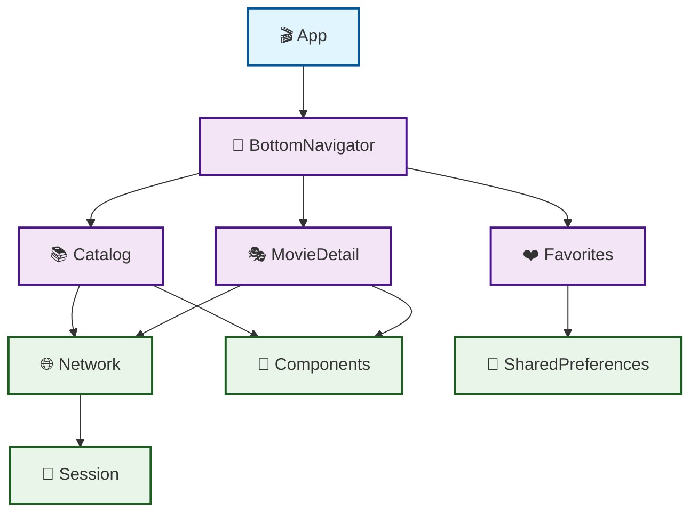

# 🎬 MovieApp

Um aplicativo iOS moderno para explor       ├── 📚   │   ├── 🎨 Components/     # Componentes reutilizáveis
   │   │   ├── GalleryView.swift
   │   │   └── SkeletonView.swiftatalog/        # Catálogo de filmes
       │   ├── CatalogConfigurator.swift
       │   ├── CatalogView.swift
       │   ├── CatalogPresenter.swift
       │   ├── CatalogInteractor.swift
       │   ├── CatalogModels.swift
       │   ├── Views/
       │   │   ├── CatalogLoadedView.swift
       │   │   └── CatalogLoadingView.swift
       │   └── Data/
       │
       ├── ❤️ Favorites/      # Gerenciamento de favoritos
       │   ├── FavoritesConfigurator.swift
       │   ├── FavoritesView.swift
       │   ├── FavoritesPresenter.swift
       │   ├── FavoritesInteractor.swift
       │   ├── FavoritesModels.swift
       │   └── Views/
       │       ├── FavoritesLoadedView.swift
       │       └── FavoritesLoadingView.swift
       │
       └── 🎭 MovieDetail/    # Detalhes do filme
           ├── MovieDetailConfigurator.swift
           ├── MovieDetailView.swift
           ├── MovieDetailPresenter.swift
           ├── MovieDetailInteractor.swift
           ├── MovieDetailModels.swift
           ├── Views/
           │   ├── MovieDetailLoadedView.swift
           │   └── MovieDetailLoadingView.swift
           └── Data/filmes, construído com Swift e arquitetura modular baseada em VIPER.

## ✨ Características

- 🏗️ **Arquitetura VIPER**: Organizado em módulos independentes seguindo princípios SOLID
- 📦 **Swift Package Manager**: Gerenciamento modular de dependências
- 📱 **SwiftUI**: Interface nativa moderna e responsiva
- 🗂️ **Catálogo de Filmes**: Explore uma vasta coleção de filmes
- ❤️ **Favoritos**: Salve seus filmes preferidos para acesso rápido
- 🧭 **Navegação Bottom Tab**: Interface de navegação intuitiva
- 🎭 **Detalhes do Filme**: Visualize informações detalhadas dos filmes
- 🌐 **Networking**: Camada de rede robusta com suporte a Async/Await
- 💾 **Session Management**: Gerenciamento de sessão e preferências

## 🏗️ Arquitetura

O projeto utiliza uma arquitetura modular baseada em **VIPER** (View, Interactor, Presenter, Entity, Router) com separação clara de responsabilidades:

```
📦 MovieApp
├── 🎬 App/                    # Aplicativo principal
│   └── MovieApp/
│       ├── MovieApp.swift     # Entry point da aplicação
│       └── Assets.xcassets/   # Recursos visuais
│
├── 🧩 Modules/
│   ├── 🛠️ Commons/           # Módulos compartilhados
│   │   ├── 🌐 Network/        # Camada de rede
│   │   │   ├── NetworkService.swift
│   │   │   ├── Endpoint.swift
│   │   │   ├── NetworkError.swift
│   │   │   └── Networkable.swift
│   │   │
│   │   ├── 🎨 Components/     # Componentes reutilizáveis
│   │   │   └── GalleryView.swift
│   │   │
│   │   ├── 🔐 Session/        # Gerenciamento de sessão
│   │   │   └── SessionManager.swift
│   │   │
│   │   └── 💾 SharedPreferences/ # Preferências compartilhadas
│   │       └── SharedPreferences.swift
│   │
│   └── 🎯 Features/           # Módulos de funcionalidades
│       ├── 🧭 BottomNavigator/ # Sistema de navegação
│       │   ├── BottomNavigatorConfigurator.swift
│       │   ├── BottomNavigatorView.swift
│       │   ├── BottomNavigatorPresenter.swift
│       │   ├── BottomNavigatorInteractor.swift
│       │   └── BottomNavigatorModels.swift
│       │
│       ├── 📚 Catalog/        # Catálogo de filmes
│       │   ├── CatalogConfigurator.swift
│       │   ├── CatalogView.swift
│       │   ├── CatalogPresenter.swift
│       │   ├── CatalogInteractor.swift
│       │   ├── CatalogModels.swift
│       │   └── Data/
│       │
│       ├── ❤️ Favorites/      # Gerenciamento de favoritos
│       │   ├── FavoritesConfigurator.swift
│       │   └── FavoritesView.swift
│       │
│       └── 🎭 MovieDetail/    # Detalhes do filme
│           ├── MovieDetailConfigurator.swift
│           └── MovieDetailView.swift
```

### 🎯 Padrão VIPER

Cada feature segue o padrão VIPER:

- **View**: Componentes SwiftUI responsáveis pela interface
- **Interactor**: Lógica de negócio e comunicação com serviços
- **Presenter**: Coordena a comunicação entre View e Interactor
- **Entity**: Modelos de dados (Models)
- **Router/Configurator**: Configuração e navegação entre módulos

### 📱 Estrutura de Views

Cada feature pode conter uma pasta **Views/** com diferentes estados da interface:

- **LoadedView**: Interface exibida quando os dados estão carregados
- **LoadingView**: Interface exibida durante o carregamento dos dados

Esta separação permite melhor organização e reutilização de componentes visuais específicos para cada estado da aplicação.

### 🔗 Dependências entre Módulos



**Legenda:**
- 🎬 **App**: Aplicativo principal
- 🎯 **Features**: Módulos de funcionalidades
- 🛠️ **Commons**: Módulos compartilhados

## 🚀 Como Executar

### Pré-requisitos

- 📱 **Xcode 15.0+**
- 🍎 **iOS 16.0+**
- 🔧 **Swift 5.9+**
- 💻 **macOS 13.0+**

### Passos para executar

1. **Clone o repositório**
   ```bash
   git clone https://github.com/rodrigogmdias/movieapp.git
   cd movieapp
   ```

2. **Abra o projeto no Xcode**
   ```bash
   open App/MovieApp.xcodeproj
   ```

3. **Aguarde a resolução das dependências**
   - O Xcode resolverá automaticamente os Swift Packages

4. **Selecione o simulador ou dispositivo**
   - Escolha seu dispositivo iOS ou simulador preferido

5. **Execute o projeto**
   - Pressione `⌘ + R` ou clique no botão "Run"

## 🧪 Executando Testes

### Testes via Xcode
- **Todos os testes**: `⌘ + U`
- **Testes específicos**: `⌘ + Shift + U`

### Testes via Terminal
```bash
# Navegar até o diretório do projeto
cd movieapp

# Executar testes de módulos específicos
cd Modules/Features/BottomNavigator && swift test
cd ../Catalog && swift test
cd ../MovieDetail && swift test
cd ../Favorites && swift test

# Testes dos módulos comuns
cd ../../Commons/Network && swift test
cd ../Session && swift test
cd ../SharedPreferences && swift test
cd ../Components && swift test
```

### Script para executar todos os testes
```bash
#!/bin/bash
echo "🧪 Executando todos os testes dos módulos..."

# Testes das Features
for module in Modules/Features/*/; do
    if [ -f "$module/Package.swift" ]; then
        echo "🧪 Testando $(basename "$module")"
        cd "$module" && swift test && cd - > /dev/null
    fi
done

# Testes dos Commons
for module in Modules/Commons/*/; do
    if [ -f "$module/Package.swift" ]; then
        echo "🧪 Testando $(basename "$module")"
        cd "$module" && swift test && cd - > /dev/null
    fi
done

echo "✅ Todos os testes executados!"
```

## 🛠️ Tecnologias Utilizadas

- **SwiftUI** - Framework de interface do usuário declarativa
- **Swift Package Manager** - Gerenciamento de dependências e módulos
- **Combine** - Framework de programação reativa
- **Async/Await** - Programação assíncrona moderna
- **VIPER** - Arquitetura modular para iOS
- **XCTest** - Framework de testes unitários
- **Xcode** - IDE de desenvolvimento
- **iOS SDK** - Plataforma de desenvolvimento

## 📝 Estrutura de Código

### Convenções de Nomenclatura
- **Arquivos**: PascalCase (ex: `MovieDetailView.swift`)
- **Classes/Structs**: PascalCase (ex: `NetworkService`)
- **Variáveis/Funções**: camelCase (ex: `fetchMovies()`)
- **Constantes**: camelCase (ex: `baseURL`)
- **Protocols**: PascalCase com sufixo "able" (ex: `Networkable`)

### Organização de Arquivos
```
ModuleName/
├── Package.swift
├── Sources/
│   └── ModuleName/
│       ├── ModuleConfigurator.swift
│       ├── ModuleView.swift
│       ├── ModulePresenter.swift
│       ├── ModuleInteractor.swift
│       ├── ModuleModels.swift
│       ├── Views/
│       │   ├── ModuleLoadedView.swift
│       │   └── ModuleLoadingView.swift
│       └── Data/
└── Tests/
    └── ModuleNameTests/
        ├── ModuleConfiguratorTests.swift
        ├── ModulePresenterTests.swift
        ├── ModuleInteractorTests.swift
        └── ModuleModelsTests.swift
```

### Padrões de Desenvolvimento

#### VIPER Pattern
- **View**: Recebe eventos do usuário e exibe dados
- **Interactor**: Contém a lógica de negócio
- **Presenter**: Coordena View e Interactor
- **Entity**: Modelos de dados
- **Router**: Navegação entre módulos

#### Dependency Injection
- Módulos são injetados via Swift Package Manager
- Configuradores gerenciam dependências
- Protocolos definem contratos entre camadas

## 🤝 Como Contribuir

### 🐛 Reportar Bugs

1. Verifique se o bug já não foi reportado nas [Issues](../../issues)
2. Abra uma nova issue com:
   - 📝 Descrição clara do problema
   - 🔄 Passos para reproduzir
   - 📱 Informações do dispositivo/simulador
   - 📸 Capturas de tela (se aplicável)

### 💡 Sugerir Melhorias

1. Abra uma issue com o label "enhancement"
2. Descreva sua ideia detalhadamente
3. Explique por que seria útil para o projeto

### 🔧 Contribuir com Código

1. **Fork o projeto**
2. **Crie uma branch para sua feature**
   ```bash
   git checkout -b feature/nova-feature
   ```
3. **Implemente seguindo as convenções**
   - Siga o padrão VIPER
   - Adicione testes para novas funcionalidades
   - Mantenha a documentação atualizada
4. **Commit suas mudanças**
   ```bash
   git commit -m "✨ Adiciona nova feature incrível"
   ```
5. **Push para a branch**
   ```bash
   git push origin feature/nova-feature
   ```
6. **Abra um Pull Request**

### 📝 Convenções de Commit

Utilizamos emojis para categorizar commits:

- ✨ `:sparkles:` - Nova feature
- 🐛 `:bug:` - Correção de bug
- 📚 `:books:` - Documentação
- 🎨 `:art:` - Melhoria de código/estrutura
- 🔧 `:wrench:` - Configuração
- ✅ `:white_check_mark:` - Testes
- 🚀 `:rocket:` - Performance
- 🔐 `:lock:` - Segurança
- 📦 `:package:` - Dependências
- 🏗️ `:building_construction:` - Arquitetura

### 🧪 Padrões de Teste

- **Cobertura mínima**: 80% para módulos críticos
- **Testes unitários**: Para Interactors e Presenters
- **Testes de integração**: Para NetworkService
- **Mocks**: Para dependências externas
- **Nomenclatura**: `test_funcionalidade_cenario_resultadoEsperado`

## 📋 Roadmap

### Fase 1 - Core Features ✅
- [x] 🏗️ Arquitetura modular VIPER
- [x] 🧭 Sistema de navegação Bottom Tab
- [x] 📚 Catálogo de filmes
- [x] ❤️ Sistema de favoritos
- [x] 🌐 Camada de rede com Async/Await
- [x] 💾 Gerenciamento de sessão

### Fase 2 - Enhancements 🚧
- [ ] 🔍 Busca de filmes
- [ ] 🎭 Tela de detalhes completa
- [ ] 🌟 Sistema de avaliações
- [ ] 📱 Adaptação para iPad
- [ ] 🌙 Modo escuro
- [ ] 🔄 Pull to refresh

### Fase 3 - Advanced Features 📋
- [ ] 🔄 Sincronização com API externa (TMDb)
- [ ] 💾 Cache local com Core Data
- [ ] 🔔 Notificações push
- [ ] 🎯 Recomendações personalizadas
- [ ] 🌍 Internacionalização (i18n)
- [ ] 🎬 Trailers de filmes
- [ ] 📊 Analytics de uso

## 📄 Licença

Este projeto está sob a licença MIT. Veja o arquivo [LICENSE](LICENSE) para mais detalhes.

## 👥 Autores

- **Rodrigo Dias** - *Desenvolvedor Principal* - [@rodrigogmdias](https://github.com/rodrigogmdias)

**Gostou do projeto? Deixe uma ⭐ se este repositório te ajudou!**

## 📞 Suporte

Tem alguma dúvida? Entre em contato:

- 📧 **Email**: rodrigogmdias@gmail.com
- 💬 **GitHub**: [@rodrigogmdias](https://github.com/rodrigogmdias)
- 🐦 **Twitter**: [@rodrigogmdias](https://twitter.com/rodrigogmdias)

## 📊 Status do Projeto


---

<p align="center">
  Feito com ❤️ e muito ☕ por <a href="https://github.com/rodrigogmdias">Rodrigo Dias</a>
</p>

<p align="center">
  <strong>Gostou do projeto? Deixe uma ⭐ se este repositório te ajudou!</strong>
</p>
